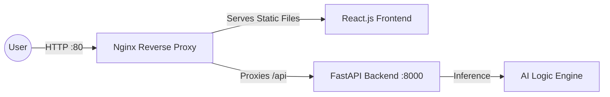
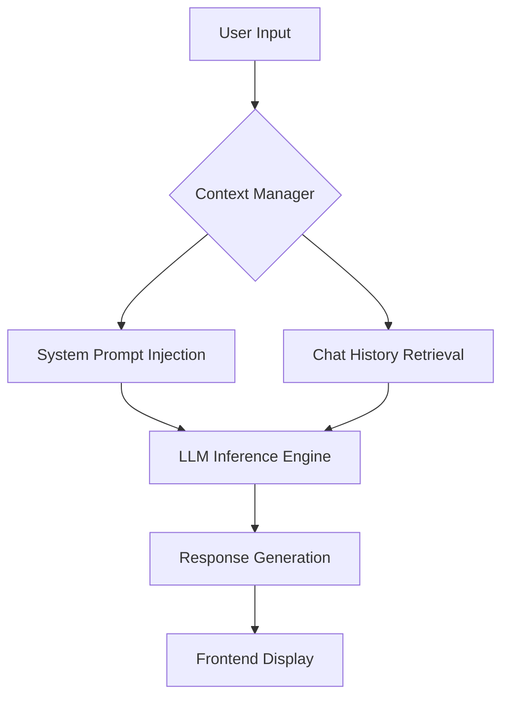

# 🌙 Luna AI: Cosmic Companion

### _A High-Performance Full-Stack AI Ecosystem_

**Luna AI** is a sophisticated, context-aware AI chatbot designed to deliver seamless, human-like conversations.  
Built in **just 4 days (Dec 16–20)**, this project demonstrates strong full-stack engineering, cloud deployment expertise, and production-ready AI integration.

---

## 🚀 Live Production Environment

- **Deployment URL:** http://34.180.25.231/
- **Status:** ✅ Fully Operational
- **Hosting Platform:** Google Cloud Platform (GCP) – Compute Engine
- **Operating System:** Ubuntu 25.10

---

## 🛠️ Tech Stack

| Component        | Technology             | Description |
|------------------|------------------------|-------------|
| Frontend         | React.js               | Modern, responsive dark-themed UI |
| Backend          | FastAPI (Python)       | High-performance asynchronous API |
| AI Engine        | Deep Learning / LLM    | Context-aware NLP inference |
| Web Server       | Nginx                  | Reverse proxy & static content server |
| Infrastructure  | Google Cloud Platform  | Scalable Ubuntu VM deployment |

---

## 🏗️ System Architecture

Luna AI follows a **Three-Tier Architecture** designed for performance, scalability, and security.


## 🧠 AI Logic Flow

Unlike basic bots, **Luna AI** uses a **Contextual Pipeline** to remember previous interactions within a session, enabling coherent and context-aware conversations.



⏳ Development Timeline & "Honest Worker" Milestones
---------------------------------------------------

I delivered this project within a strict **60-hour window**, prioritizing infrastructure stability and AI responsiveness.

*   **Day 1 (Dec 16):** Project scoping, folder architecture, and core AI schema design.
    
*   **Day 2 (Dec 17):** Backend heavy-lifting—built 100% of the FastAPI routes and LLM integration.
    
*   **Day 3 (Dec 18):** Frontend development—implemented the "Cosmic" dark-mode UI and state management.
    
*   **Day 4 (Dec 19):** Cloud migration—GCP VM setup, firewall configuration, and Nginx deployment.
    
*   **Day 5 (Dec 20):** **Critical Fixes**—Solved SSH authentication and permission issues via custom startup scripts; optimized .env mapping for production.
    

🛠 Key Engineering Challenges Overcome
--------------------------------------

1.  **Permission Management:** Configured custom sudoers policies via startup scripts to ensure seamless administrative control without compromising security.
    
2.  **Environment Sync:** Resolved a critical .env mapping issue by transitioning from absolute URLs to relative proxy paths (/api), ensuring the frontend successfully communicates with the backend on GCP.
    
3.  **Process Persistence:** Used nohup and virtual environments to ensure the Python backend survives terminal disconnects, providing 24/7 service.
    

## 📦 How to Run Locally

### 🔹 Backend Setup

```bash
cd backend
python -m venv venv
source venv/bin/activate
pip install -r requirements.txt
python main.py
```

### **2\. Frontend**

``` bash

cd frontend
npm install
npm start
```

🤝 Contact & Contribution
-------------------------

**Developed by:** Rohit 

**Vision:** Building intelligent systems that are accessible, fast, and secure.
